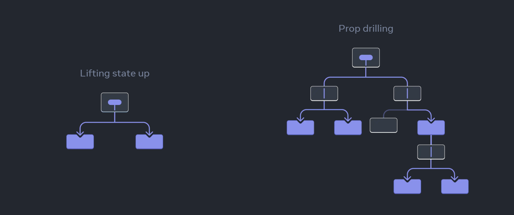
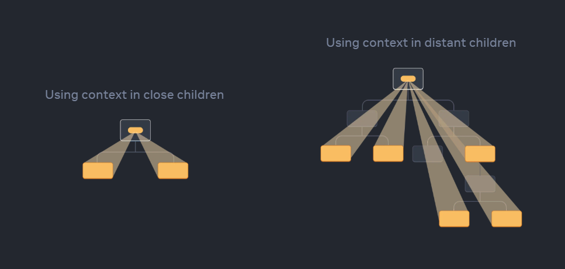

# Module 10, Context API & useReducer Hook

## Context API

Context API used to share data accross components without having to pass props down manually from parent to child components.
The idea is by act as a "wrapper" to wrap components, this wrapper can be used to stored states that can be accessed by all components.

Usually, we use lifting state up and prop drilling to pass data from parent to child components.



However, what if there are many nested components and we want to share data from a deep component to another?
If we use prop drilling, it will be very tedious to pass data from deep component to parent component.

In this case, we can use Context API.



From illustration above, we can see that Context API can be used in close children or in distant children.

```javascript
// somewhere in a file
import {createContext} from "react";

export const CartContext  = createContext({
    items: [],
});


// somewhere in another file
<CartContext.Provider>
    <Header/>
    <Shop />
</CartContext.Provider>
```

From above code example, we use context API to wrap Header and Shop components. 
Later, we can access the context item from deep inside in both Header and Shop components.