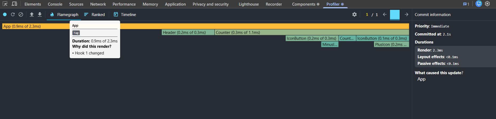
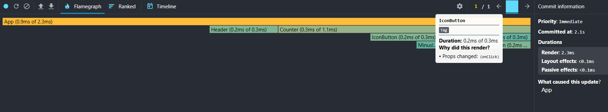
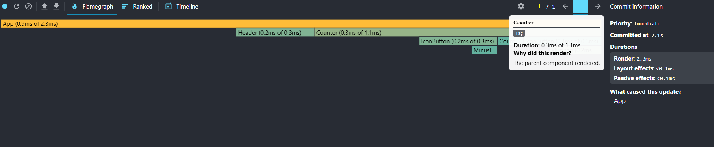

# Optimization Techniques

## Profiling React Apps

Profiling help identify the components render. We can know why a component is re-rendering.
We can check:

1. component re-rendering by state change

    

2. component re-rendering by props change

    

3. component re-rendering by parent re-rendering

    

4. etc.

Check this one out: https://chromewebstore.google.com/detail/react-developer-tools

