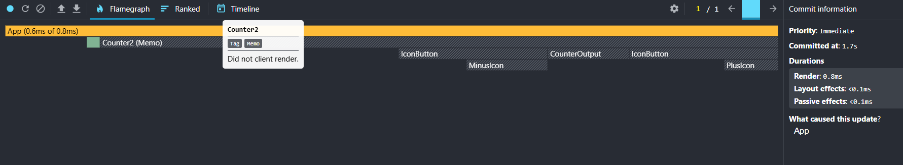

# Optimization Techniques

## Profiling React Apps

Profiling help identify the components render. We can know why a component is re-rendering.
We can check:

1. component re-rendering by state change

    

2. component re-rendering by props change

    

3. component re-rendering by parent re-rendering

    

4. etc.

Check this one out: https://chromewebstore.google.com/detail/react-developer-tools

## memo()

Memo is a React function to skip a rendering component process.

```javascript
const Counter = memo(function Counter({ initialCount }) {
    // component creation ...
});

export default Counter;
```

After using memo, in profiling there would be info "did not client render":



This is because the memo will validate if there is any change in the props.
If props is still same from previous render, the memo function will prevent the component from being rendered.

Also, memo only works if only the parent component is changing.

### Don't over use memo()!

1. If use in high up component will prevent the child component from rendering.
2. checking props is expensive operation cost lot performance, will only add unnecessary check.
3. Don't use it on component where props change frequently.